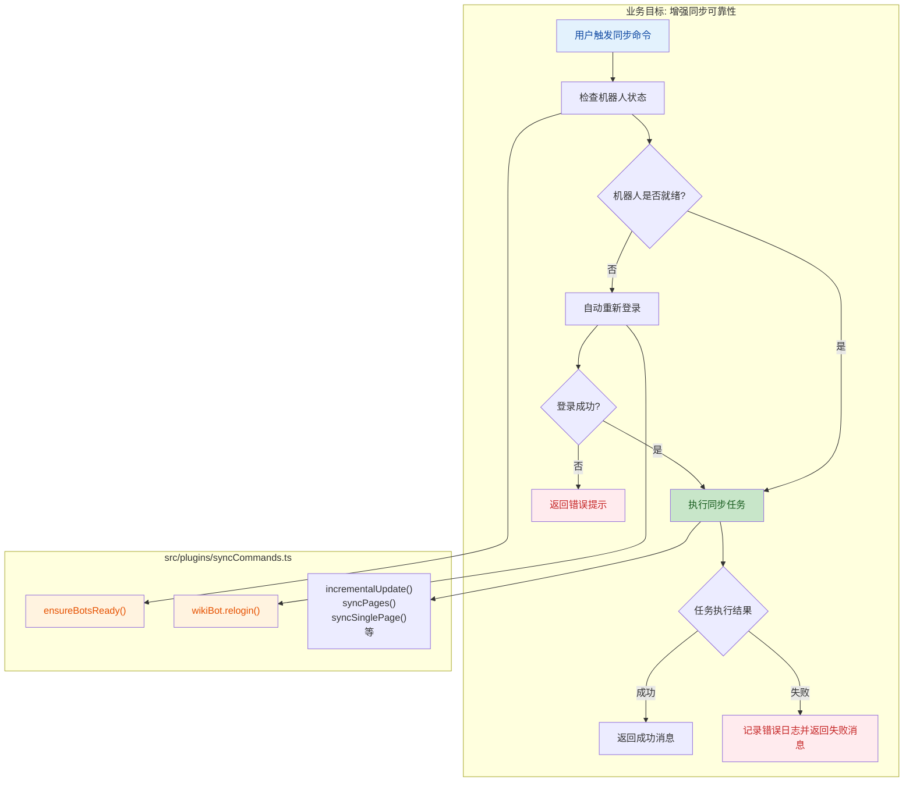

## 1. 高层摘要 (TL;DR)

- **影响范围:** 🟡 **中等** - 重构了同步命令模块的错误处理和机器人就绪检查逻辑
- **核心变更:**
  - ✨ 新增**自动重新登录**机制，当机器人未就绪时自动尝试重新登录
  - 🔧 重构所有命令处理函数，从 Promise 链式调用改为 `try-catch` 异步错误处理
  - 🧹 移除冗余的实例 Logger，统一使用全局 logger
  - 🐛 修正 `moduleSync.ts` 中的拼写错误（`MODLE_NAMESPACE` → `MODULE_NAMESPACE`）
  - 📦 版本号升级至 `0.8.5`

---

## 2. 可视化概览 (代码与逻辑映射)



**关键改进流程:**

1. **旧逻辑**: 机器人未就绪 → 直接跳过任务
2. **新逻辑**: 机器人未就绪 → 尝试自动重新登录 → 登录成功则执行任务，失败则跳过

---

## 3. 详细变更分析

### 📦 依赖与配置

| 文件           | 配置项    | 旧值    | 新值    | 说明       |
| -------------- | --------- | ------- | ------- | ---------- |
| `package.json` | `version` | `0.8.4` | `0.8.5` | 版本号递增 |

---

### 🤖 核心模块: `src/plugins/syncCommands.ts`

#### **1. 移除实例 Logger**

- **变更内容**: 删除了 `this.log` 实例变量及其初始化代码
- **原因**: 统一使用全局 `logger`，减少冗余代码

```typescript
// ❌ 删除
public log: Logger;
constructor(ctx: Context, config: SyncCommandsConfig) {
  this.log = ctx.logger("oni-sync");
  // ...
}
```

#### **2. 机器人就绪检查增强**

- **方法重命名**: `checkBotsReady()` → `ensureBotsReady()`
- **签名变更**: `boolean` → `Promise<boolean>`（变为异步方法）
- **新增功能**:

* 检测到机器人未就绪时自动调用 `wikiBot.relogin()`
* 提供更详细的状态日志（包含 WIKIGG 和 bwiki 的独立状态）

| 特性       | 旧实现           | 新实现                        |
| ---------- | ---------------- | ----------------------------- |
| 方法类型   | 同步             | 异步                          |
| 未就绪处理 | 直接返回 `false` | 尝试重新登录后再检查          |
| 日志详细度 | 简单警告         | 包含各机器人具体状态（✅/❌） |

**核心逻辑对比:**

```typescript
// ❌ 旧实现
private checkBotsReady(ctx: Context): boolean {
  const ggReady = ctx.wikiBot.isGGBotReady();
  const bwReady = ctx.wikiBot.isBWikiBotReady();
  return ggReady && bwReady;
}

// ✅ 新实现
private async ensureBotsReady(ctx: Context, taskName: string): Promise<boolean> {
  if (!ctx.wikiBot.isGGBotReady() || !ctx.wikiBot.isBWikiBotReady()) {
    logger.warn(`检测到部分机器人未就绪，尝试重新登录...`);
    try {
      await ctx.wikiBot.relogin();
    } catch (error) {
      logger.error(`重新登录失败: ${error}`);
      return false;
    }
  }

  const ggReady = ctx.wikiBot.isGGBotReady();
  const bwikiReady = ctx.wikiBot.isBWikiBotReady();

  if (!ggReady || !bwikiReady) {
    logger.warn(`${taskName} 跳过：Wiki 机器人仍未就绪 - WIKIGG: ${ggReady ? "✅" : "❌"}, bwiki: ${bwikiReady ? "✅" : "❌"}`);
    return false;
  }

  return true;
}
```

#### **3. 命令处理函数重构**

所有 8 个命令处理函数都进行了统一重构：

| 命令                        | 变更类型               |
| --------------------------- | ---------------------- |
| `sync <pageTitle>`          | Promise 链 → try-catch |
| `sync.update` (增量更新)    | Promise 链 → try-catch |
| `sync.allpages`             | Promise 链 → try-catch |
| `sync.module <moduleTitle>` | Promise 链 → try-catch |
| `sync.allmodules`           | Promise 链 → try-catch |
| `sync.img <imgTitle>`       | Promise 链 → try-catch |
| `sync.allimgs`              | Promise 链 → try-catch |
| 定时任务 (3个 cron)         | Promise 链 → try-catch |

**重构模式示例:**

```typescript
// ❌ 旧实现
.action(async ({ session }, pageTitle) => {
  if (!this.checkBotsReady(ctx)) {
    return session.send("❌ Wiki 机器人未就绪");
  }
  await syncSinglePage(...)
    .then(() => {
      session.send(`✅ 已尝试同步页面：${pageTitle}`);
    })
    .catch((err) => {
      session.send(`❌ 同步页面失败：${pageTitle}`);
      this.log.error(`，错误信息：${err}`);
    });
});

// ✅ 新实现
.action(async ({ session }, pageTitle) => {
  if (!(await this.ensureBotsReady(ctx, "同步页面"))) {
    return "❌ Wiki 机器人未就绪";
  }
  try {
    await syncSinglePage(...);
    return `✅ 已尝试同步页面：${pageTitle}，请前往控制台查看：${this.config.logsUrl}`;
  } catch (err) {
    logger.error(`同步页面 ${pageTitle} 失败，错误信息：${err}`);
    return `❌ 同步页面失败：${pageTitle}`;
  }
});
```

**重构优势:**

- ✅ 代码更简洁，减少嵌套层级
- ✅ 错误处理更集中
- ✅ 移除了冗余的 `session.send()` 调用（直接返回字符串）
- ✅ 统一使用全局 logger 记录错误

---

### 📝 模块同步: `src/sync/moduleSync.ts`

#### **拼写错误修正**

| 位置                   | 旧拼写                                | 新拼写                                 | 影响                 |
| ---------------------- | ------------------------------------- | -------------------------------------- | -------------------- |
| CONFIG 对象            | `MODLE_NAMESPACE`                     | `MODULE_NAMESPACE`                     | 代码可读性提升       |
| `getAllModules()` 日志 | `CONFIG.MODLE_NAMESPACE`              | `CONFIG.MODULE_NAMESPACE`              | 日志输出正确         |
| API 查询参数           | `apnamespace: CONFIG.MODLE_NAMESPACE` | `apnamespace: CONFIG.MODULE_NAMESPACE` | 功能无影响（值未变） |

#### **调试代码清理**

```typescript
// ❌ 删除
console.log(oldModuleList);
```

---

## 4. 影响与风险评估

### ⚠️ 破坏性变更

| 变更项                          | 影响                             | 兼容性    |
| ------------------------------- | -------------------------------- | --------- |
| `checkBotsReady()` 方法签名变更 | 内部方法，无外部调用             | ✅ 无影响 |
| 移除 `this.log`                 | 内部实现细节                     | ✅ 无影响 |
| 命令返回值处理方式              | 命令行为保持一致，仅内部实现变化 | ✅ 无影响 |

### ✅ 功能增强

- 🔄 **自动恢复能力**: 机器人会话过期时可自动重新登录，减少人工干预
- 📊 **更好的可观测性**: 日志中包含各机器人的独立状态标识
- 🎯 **代码一致性**: 所有命令处理函数使用统一的错误处理模式

### 🧪 测试建议

#### **必须测试的场景:**

1. **机器人未就绪场景**:
   - 模拟 WIKIGG 或 bwiki 机器人未登录状态
   - 验证是否触发自动重新登录
   - 验证重新登录成功后任务是否正常执行
   - 验证重新登录失败后是否正确返回错误消息

2. **所有同步命令**:
   - `sync <页面名>` - 单页面同步
   - `sync.update` - 增量更新
   - `sync.allpages` - 全页面同步
   - `sync.module <模块名>` - 单模块同步
   - `sync.allmodules` - 全模块同步
   - `sync.img <图片名>` - 单图片同步
   - `sync.allimgs` - 全图片同步

3. **定时任务**:
   - 验证每小时 15 分的增量更新任务
   - 验证每周三 8:30 的图片同步任务
   - 验证每周四 8:30 的页面同步任务

4. **错误处理**:
   - 模拟网络错误、API 错误等异常情况
   - 验证错误日志是否正确记录
   - 验证用户是否收到友好的错误提示

#### **回归测试:**

- 确认所有原有功能在正常情况下（机器人已就绪）仍能正常工作
- 验证日志输出格式符合预期

---
